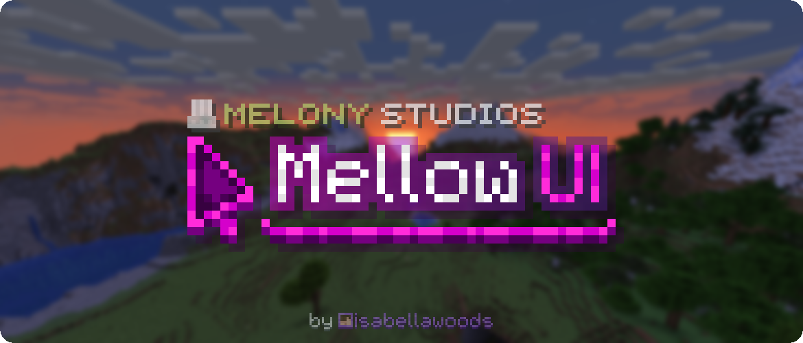
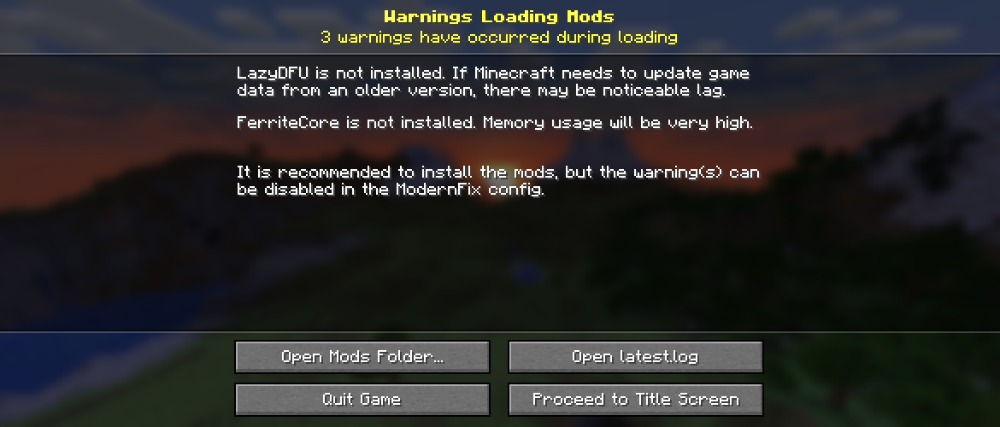
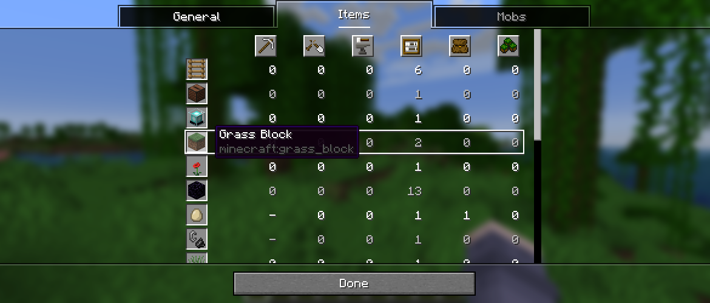
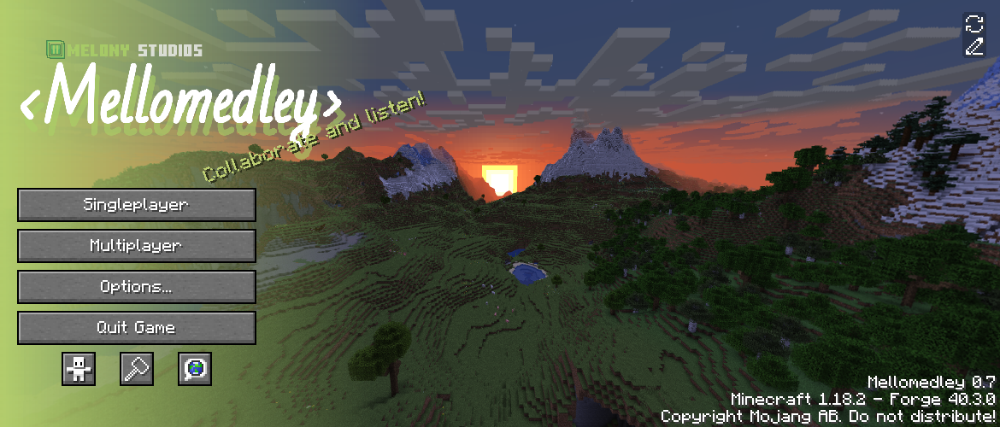
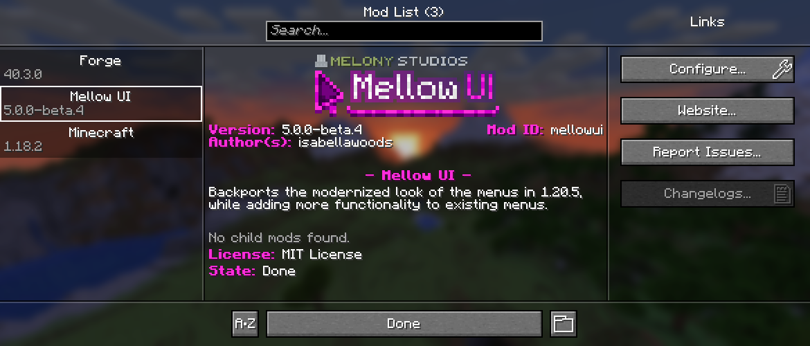
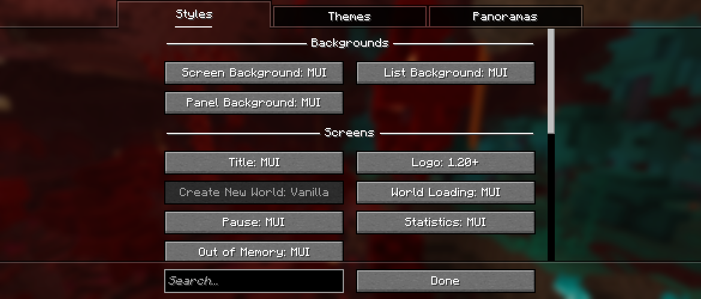
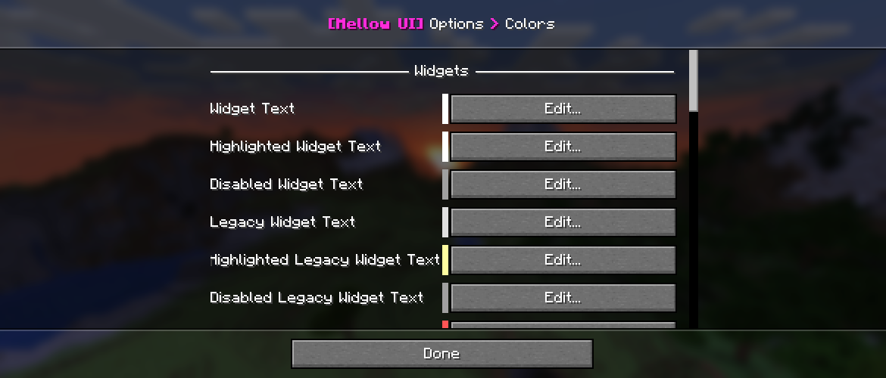
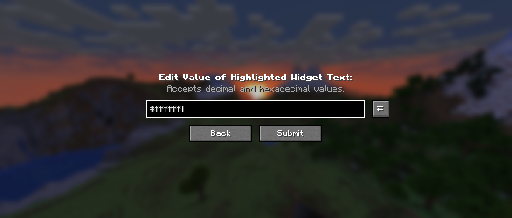

  

*For Forge 1.16.5 and 1.18.2*

***Mellow UI*** is a mod that brings the updated interfaces from [**Java Edition 1.20.5**](https://minecraft.wiki/w/Java_Edition_1.20.5) into 1.16, with various toggles for newer and older features.

This mod is *meant* to be **client-side only**, and it doesn't have any dependencies besides *Minecraft* 1.16.4, 1.16.5 or 1.18.2.

## Compatibility
*Mellow UI* has compatibility with a few mods:
- **Rubidium** / **Embeddium**: Uses the mod's video settings screen by default, with the option to switch back;
    - When using this mod's style, the "Shader Packs" and "Max Shadow Distance" buttons, from *Oculus*, aren't added.
- **Catalogue**: Uses the mod's mod list screen by default with the option to switch back;
- **Better Statistics Screen**: Uses  the mod's statistics screen by default, with the option to switch back;
- **Blueprint**: Adds the "Slabfish Hat Settings" button to the skin customization screen;
- **Female Gender Mod**: Adds a button on the options screen to the mod's wardrobe screen.

## Updated Screens
As of version **5.0.0 Beta 4**, most screens accessed from the title screen have been updated, besides the multiplayer screens and some options screens.

|                                                     |                                                                                                                                                                           |
|-----------------------------------------------------|---------------------------------------------------------------------------------------------------------------------------------------------------------------------------|
|      | *The title screen, showing the updated logo, text and the backported music toast.*                                                                                        |
|           | *The options screen, with the reintroduction of the Super Secret Settings, and some new buttons as well.*                                                                 |
|  | *The create new world screen, backport from [**Java Edition 1.19.4**](https://minecraft.wiki/w/Java_Edition_1.19.4). Still a work in progress though!*                    |
|    | *Forge's loading warnings/errors screen, with only minor tweaks such as text positions and width.*                                                                        |
|        | *The statistics screen, backported directly from [**Java Edition 1.21.9**](https://minecraft.wiki/w/Java_Edition_1.21.9). Functionally, it is a near perfect recreation.* |

## New Screens
Besides updating existing screens to add new functionality, this mod also adds some screens of its own, mostly for configuring features of the mod. These are:

|                                                               |                                                                                                                                                                                           |
|---------------------------------------------------------------|-------------------------------------------------------------------------------------------------------------------------------------------------------------------------------------------|
|    | *The Mellomedley title screen, made for a personal modpack of the same name.*                                                                                                             |
|                    | *Mellow UI's mod list. I've decided to split it into three parts: the mod list, the information panel, and the links.*                                                                    |
|  | *The Super Secret Settings screen, now with a convenient list and search field. The **NTSC** shader is selected, which renders differently depending on your graphics card or something.* |
|            | *Mellow UI's general options screen. It can be used to customize most of the mod's features.*                                                                                             |
|               | *Mellow UI's customization options screen. It can be used to change screen styles, themes and panoramas.*                                                                                 |
|               | *Mellow UI's color options screen, used to change the colors of text or backgrounds.*                                                                                                     |
|                  | *The value editing screen, shown when altering a color or text padding.*                                                                                                                  |
