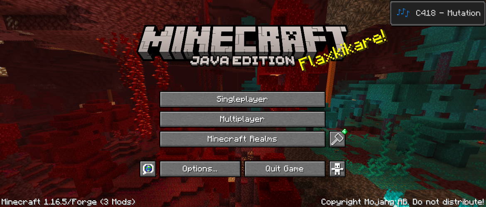
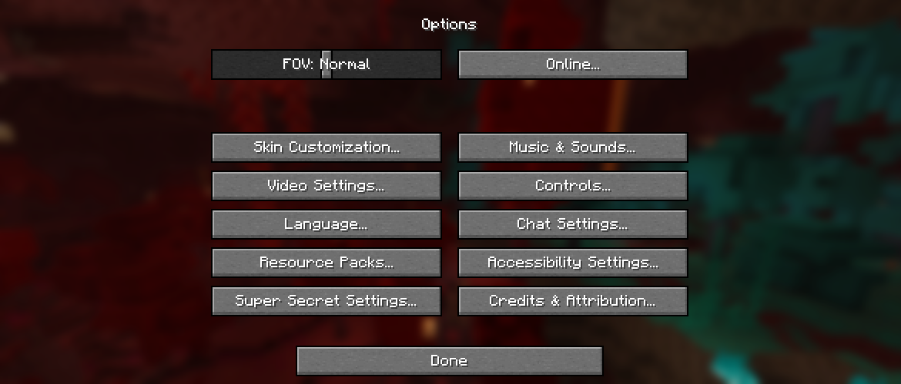
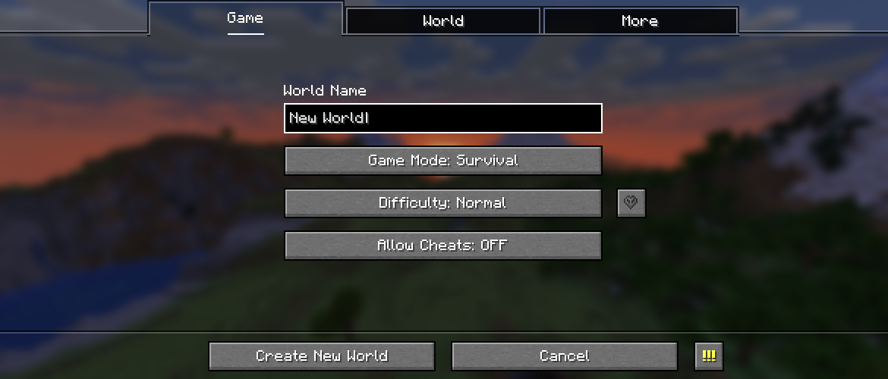
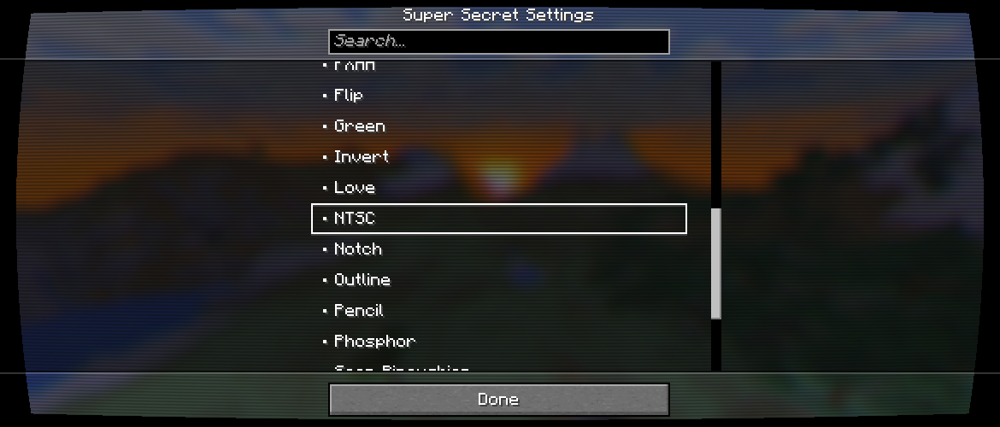
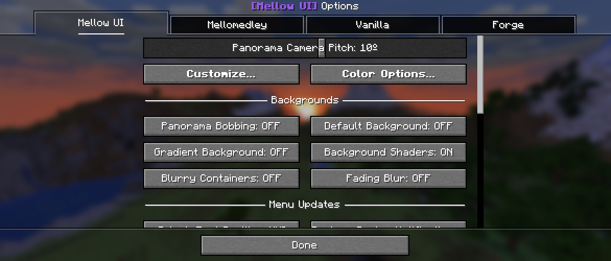

*For Forge 1.16.5 and 1.18.2*

**Mellow UI** is a mod that backports the modernized UI from [**Java Edition 1.20.5**](https://minecraft.wiki/w/Java_Edition_1.20.5),
while adding more functionality to existing menus, like readding super secret settings.

## Updated Screens
As of version **4.3.1**, most screens accessed from the title screen have been updated, except for a few (like the resource packs screen).

Below is a demonstration of some of these updated screens:

| | |
|-|-|
|  |*The title screen, showing the updated logo, text and the backported music toast.* |
|  | *The options screen, with the reintroduction of super secret settings, and some new buttons as well.* |
|  | *The create new world screen, backport from [**Java Edition 1.19.4**](https://minecraft.wiki/w/Java_Edition_1.19.4). Still a work in progress though!* |

## New Screens
This mod adds some new screens for its own functionality, like for the reintroduction of super secret settings.

Below are some of the new screens added by *Mellow UI*:

| | |
|-|-|
|  | *The super secret settings screen, now with a convenient list. The **NTSC** shader is selected, which renders like this for me.* |
|  | *Mellow UI's options screen. It can be used to customize 90% of the mods's features.* |